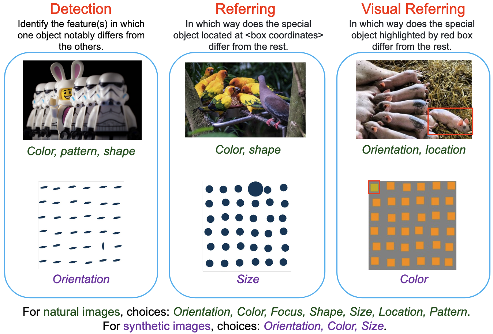
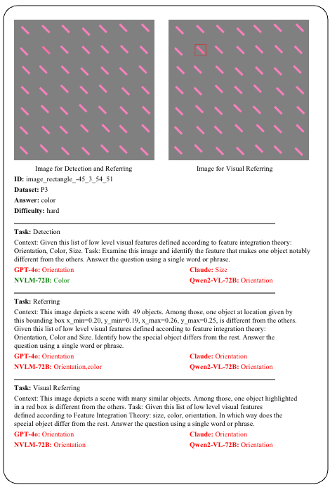
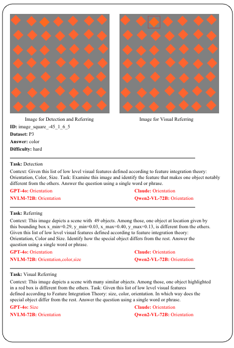
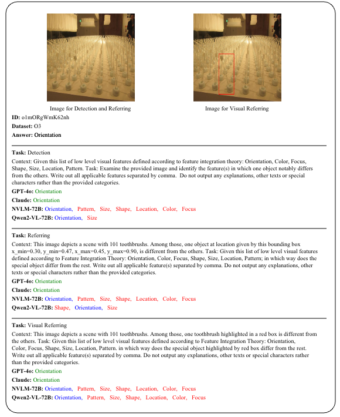
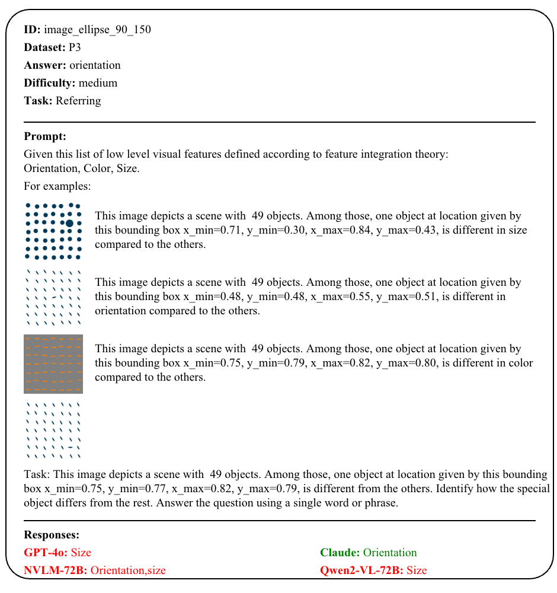
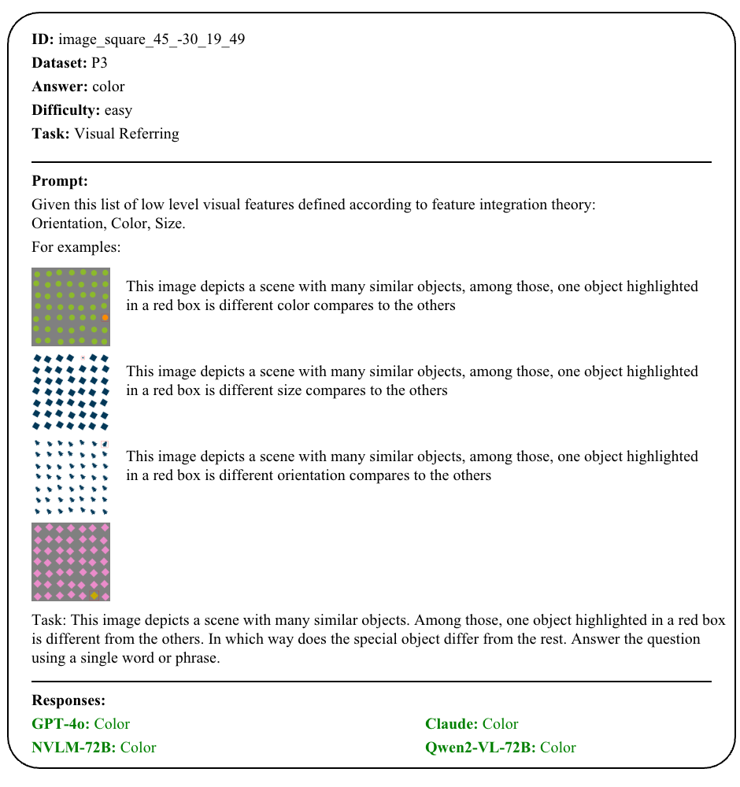
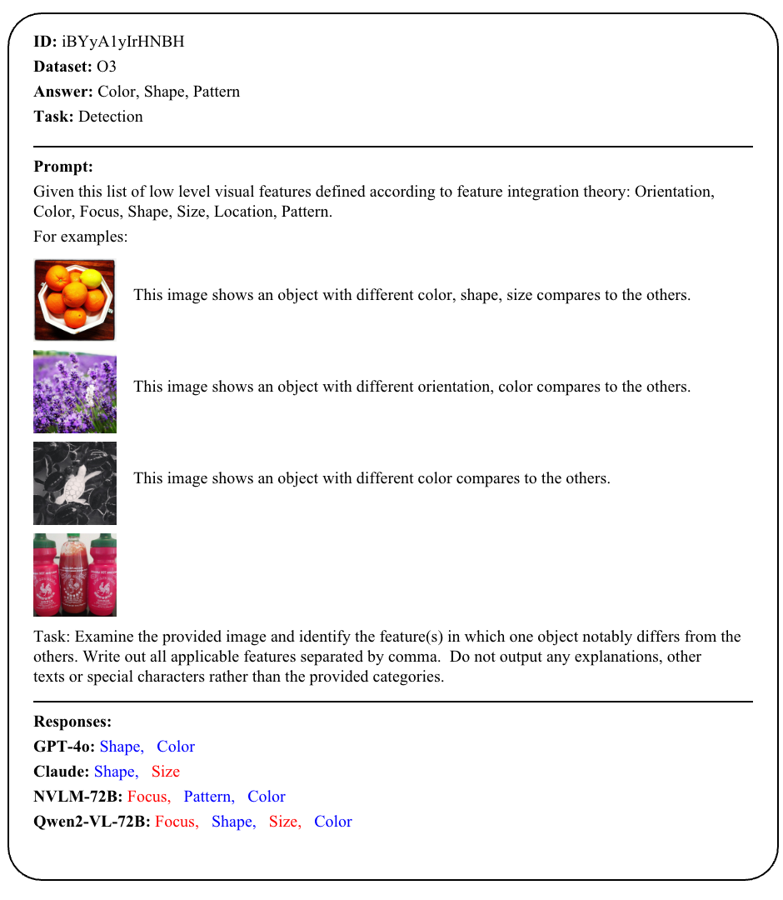
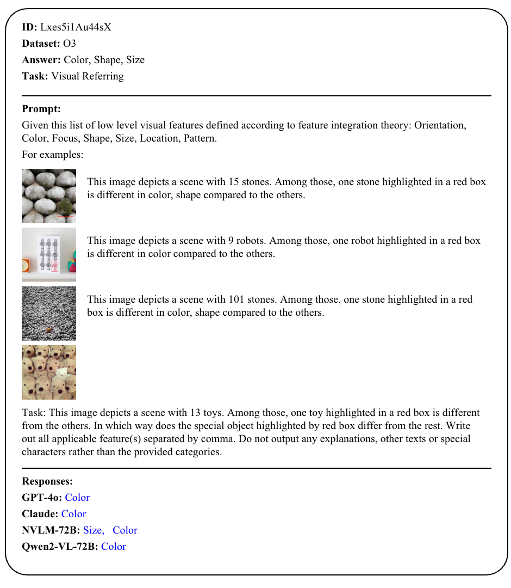

# *SalBench: A Benchmark for Evaluating Perceptual Capabilities of Vision-Language Models*


[[ HF dataset ](https://huggingface.co/datasets/salbench-vlm/salbench)] [[📊 Leaderboard ](https://github.com/salbench/salbench)][[📖 ArXiv Paper](Comming Soon)]

## Introduction
We present Saliency Benchmark (SalBench), a novel benchmark designed to assess the capability of Large Vision-Language Models (LVLM) in detecting visually salient features that are readily apparent to humans, such as a large circle amidst a grid of smaller ones. This benchmark focuses on low-level features including color, intensity, and orientation, which are fundamental to human visual processing. Our SalBench consists of images that highlight rare, unusual, or unexpected elements within scenes, and naturally draw human attention. It comprises three novel tasks for evaluating the perceptual capabilities of LVLM: Odd-One-Out Detection, Referring Odd-One-Out, and Visual Referring Odd-One-Out. We perform a comprehensive evaluation of state-of-the-art LVLM using SalBench and our findings reveal a surprising limitation: LVLM struggle to identify seemingly obvious visual anomalies, with even the advanced GPT-4o achieving only 47.6\% accuracy on such a simple task. SalBench will be an important step in measuring the capabilities of LVLM that align with the subtle definition of human attention.
### Key Tasks in SalBench

#### 1. Salient Object Detection
- **Objective**: Evaluate the model's ability to identify and segment the most visually important objects in an image.  
- **Description**: The model is tasked with distinguishing salient objects from the background, mimicking human attention.  
- **Significance**: Critical for applications like autonomous driving and medical imaging where detecting key objects is vital.

#### 2. Visual Question Answering (VQA) on Salient Regions
- **Objective**: Test the model's ability to answer questions that require attention to specific, salient regions of an image.  
- **Description**: The model must extract relevant information from highlighted regions to provide accurate answers.  
- **Significance**: Measures the integration of visual perception and language understanding.

#### 3. Referring Expression Segmentation
- **Objective**: Assess the model’s capacity to segment objects based on natural language descriptions.  
- **Description**: The model must accurately segment the object referred to by a user-provided textual phrase.  
- **Significance**: Important for human-computer interaction, allowing intuitive control through verbal instructions.

### Visualization
<!-- {width=500 height=300} -->
<!--  -->
<div align="center">
    
</div>

## Saliency Training Dataset Generation

To facilitate research and improvements in saliency-based tasks, we provide a dataset generation pipeline that automatically creates training data tailored for saliency detection. This dataset is designed to enhance the model’s ability to identify visually salient features, improving its performance across various SalBench tasks.

### Installation

To set up the required dependencies, run:

```bash
pip install -r requirements.txt
```

### Dataset Generation Workflow

The dataset can be generated using the following scripts:

1. **Download necessary fonts** (if required for synthetic data generation):
   ```bash
   ./scripts/download_font.sh
   ```

2. **Generate pretraining data**:
   ```bash
   ./scripts/pretrain_data_generation.sh
   ```
   - This script creates a **foundational dataset** designed to expose models to salient patterns and anomalies.

3. **Generate supervised fine-tuning (SFT) data**:
   ```bash
   ./scripts/sft_data_generation.sh
   ```
   - This step prepares data for **supervised learning**, refining model performance on saliency-based tasks.

These scripts streamline the creation of training data, ensuring **reproducibility and flexibility** for future research.


## Leaderboard

#### + Exact Match and F1-Scores on the synthetic image set (**P3**) of SalBench.

<table>
    <tr style="border-top: 2px solid black;">
        <th rowspan="3">Model</th>
        <th rowspan="3" style="text-align: center; border-right: 1px solid black;">Shot</th>
        <th colspan="3" rowspan="2" style="text-align: center; border-right: 1px solid black;">Overall Matching</th>
        <th colspan="12" style="text-align: center;">F1 Score</th>
    </tr>
    <tr>
        <th colspan="3" style="text-align: center; border-right: 1px solid black;">Overall</th>
        <th colspan="3" style="text-align: center; border-right: 1px solid black;">Orientation</th>
        <th colspan="3" style="text-align: center; border-right: 1px solid black;">Color</th>
        <th colspan="3" style="text-align: center">Size</th>
    </tr>
    <tr>
        <th style="text-align: center;">D</th>
        <th style="text-align: center;">R</th>
        <th style="border-right: 1px solid black;">VR</th>
        <th style="text-align: center;">D</th>
        <th style="text-align: center;">R</th>
        <th style="border-right: 1px solid black;">VR</th>
        <th style="text-align: center;">D</th>
        <th style="text-align: center;">R</th>
        <th style="border-right: 1px solid black;">VR</th>
        <th style="text-align: center;">D</th>
        <th style="text-align: center;">R</th>
        <th style="border-right: 1px solid black;">VR</th>
        <th style="text-align: center;">D</th>
        <th style="text-align: center;">R</th>
        <th style="text-align: center; border-right: 1px solid black;">VR</th>
    </tr>
    <tr>
        <td>Claude-sonet</td>
        <td style="border-right: 1px solid black;">0</td>
        <td>86.4</td>
        <td>89.0</td>
        <td style="border-right: 1px solid black;">87.8</td>
        <td>86.7</td>
        <td>90.3</td>
        <td style="border-right: 1px solid black;">87.7</td>
        <td>83.4</td>
        <td>87.6</td>
        <td style="border-right: 1px solid black;">85.3</td>
        <td>94.6</td>
        <td>95.4</td>
        <td style="border-right: 1px solid black;">95.5</td>
        <td>82.0</td>
        <td>87.9</td>
        <td>82.2</td>
    </tr>
    <tr>
        <td>NVLM-D-72B</td>
        <td style="border-right: 1px solid black;">0</td>
        <td>83.4</td>
        <td >57.9</td>
        <td style="border-right: 1px solid black;">59.8</td>
        <td>83.2</td>
        <td>73.7</td>
        <td style="border-right: 1px solid black;">51.7</td>
        <td>77.4</td>
        <td>75.1</td>
        <td style="border-right: 1px solid black;">61.8</td>
        <td>98.0</td>
        <td >80.2</td>
        <td style="border-right: 1px solid black;">80.4</td>
        <td>74.1</td>
        <td>65.7</td>
        <td>12.7</td>
    </tr>
    <tr>
        <td>Molmo-7B</td>
        <td style="border-right: 1px solid black;">0</td>
        <td>71.3</td>
        <td>45.4</td>
        <td style="border-right: 1px solid black;">30.1</td>
        <td>67.2</td>
        <td>38.0</td>
        <td style="border-right: 1px solid black;">28.4</td>
        <td>40.8</td>
        <td>62.3</td>
        <td style="border-right: 1px solid black;">34.5</td>
        <td>95.3</td>
        <td>23.3</td>
        <td style="border-right: 1px solid black;">15.7</td>
        <td>69.3</td>
        <td>28.5</td>
        <td>22.3</td>
    </tr>
    <tr>
        <td>Molmo-72B</td>
        <td style="border-right: 1px solid black;">0</td>
        <td>84.1</td>
        <td>67.0</td>
        <td style="border-right: 1px solid black;">75.5</td>
        <td>83.4</td>
        <td>65.6</td>
        <td style="border-right: 1px solid black;">73.6</td>
        <td>80.7</td>
        <td>73.4</td>
        <td style="border-right: 1px solid black;">77.5</td>
        <td>96.5</td>
        <td>69.4</td>
        <td style="border-right: 1px solid black;">84.5</td>
        <td>72.9</td>
        <td>54.0</td>
        <td>58.5</td>
    </tr>
    <tr>
        <td>LLama3.2-Vision-11B</td>
        <td style="border-right: 1px solid black;">0</td>
        <td>51.4</td>
        <td>17.6</td>
        <td style="border-right: 1px solid black;">55.5</td>
        <td>48.7</td>
        <td>52.4</td>
        <td style="border-right: 1px solid black;">52.4</td>
        <td>52.6</td>
        <td>57.9</td>
        <td style="border-right: 1px solid black;">59.7</td>
        <td>62.7</td>
        <td>58.6</td>
        <td style="border-right: 1px solid black;">69.7</td>
        <td>30.9</td>
        <td>40.7</td>
        <td>27.8</td>
    </tr>
    <tr>
        <td>PaliGemma-3B-448</td>
        <td style="border-right: 1px solid black;">0</td>
        <td>39.7</td>
        <td>7.1</td>
        <td style="border-right: 1px solid black;">2.4</td>
        <td>41.4</td>
        <td>9.5</td>
        <td style="border-right: 1px solid black;">4.8</td>
        <td>0.9</td>
        <td>4.9</td>
        <td style="border-right: 1px solid black;">0.0</td>
        <td>67.0</td>
        <td>21.5</td>
        <td style="border-right: 1px solid black;">2.8</td>
        <td>55.1</td>
        <td>2.0</td>
        <td>11.7</td>
    </tr>
    <tr>
        <td rowspan="3">Phi3-4B</td>
        <td style="border-right: 1px solid black;">0</td>
        <td>51.3</td>
        <td>59.0</td>
        <td style="border-right: 1px solid black;">52.1</td>
        <td>41.2</td>
        <td>55.3</td>
        <td style="border-right: 1px solid black;">47.2</td>
        <td>12.4</td>
        <td>66.3</td>
        <td style="border-right: 1px solid black;">45.9</td>
        <td>45.3</td>
        <td>50.5</td>
        <td style="border-right: 1px solid black;">62.8</td>
        <td>65.9</td>
        <td>49.1</td>
        <td>32.9</td>
    </tr>
    <tr>
        <td style="border-right: 1px solid black;">3</td>
        <td>43.4</td>
        <td>39.0</td>
        <td style="border-right: 1px solid black;">47.1</td>
        <td>33.5</td>
        <td>27.1</td>
        <td style="border-right: 1px solid black;">38.6</td>
        <td>24.0</td>
        <td>17.3</td>
        <td style="border-right: 1px solid black;">5.8</td>
        <td>26.5</td>
        <td>54.9</td>
        <td style="border-right: 1px solid black;">55.0</td>
        <td>50.0</td>
        <td>9.1</td>
        <td>55.0</td>
    </tr>
    <tr>
        <td style="border-right: 1px solid black;">5</td>
        <td>34.2</td>
        <td>35.1</td>
        <td style="border-right: 1px solid black;">50.8</td>
        <td>17.0</td>
        <td>18.9</td>
        <td style="border-right: 1px solid black;">46.7</td>
        <td>0.0</td>
        <td>4.7</td>
        <td style="border-right: 1px solid black;">34.5</td>
        <td>51.0</td>
        <td>51.6</td>
        <td style="border-right: 1px solid black;">66.6</td>
        <td>0.0</td>
        <td>0.4</td>
        <td>39.1</td>
    </tr>
    <tr>
        <td rowspan="3">Phi3.5-Vision-3.5B</td>
        <td style="border-right: 1px solid black;">0</td>
        <td>44.0</td>
        <td>59.9</td>
        <td style="border-right: 1px solid black;">64.9</td>
        <td>35.0</td>
        <td>53.7</td>
        <td style="border-right: 1px solid black;">63.6</td>
        <td>2.1</td>
        <td>53.7</td>
        <td style="border-right: 1px solid black;">53.7</td>
        <td>49.2</td>
        <td>50.9</td>
        <td style="border-right: 1px solid black;">71.3</td>
        <td>53.7</td>
        <td>56.6</td>
        <td>65.9</td>
    </tr>
    <tr>
        <td style="border-right: 1px solid black;">3</td>
        <td>26.7</td>
        <td>49.8</td>
        <td style="border-right: 1px solid black;">34.7</td>
        <td>19.5</td>
        <td>41.0</td>
        <td style="border-right: 1px solid black;">20.8</td>
        <td>0.0</td>
        <td>0.5</td>
        <td style="border-right: 1px solid black;">3.0</td>
        <td>18.2</td>
        <td>66.7</td>
        <td style="border-right: 1px solid black;"`>9.9</td>
        <td>40.3</td>
        <td>55.8</td>
        <td>49.5</td>
    </tr>
    <tr>
        <td style="border-right: 1px solid black;">5</td>
        <td>35.2</td>
        <td>24.1</td>
        <td style="border-right: 1px solid black;">33.8</td>
        <td>29.3</td>
        <td>11.1</td>
        <td style="border-right: 1px solid black;">19.0</td>
        <td>1.5</td>
        <td>0.2</td>
        <td style="border-right: 1px solid black;">0.0</td>
        <td>38.9</td>
        <td>26.0</td>
        <td style="border-right: 1px solid black;">7.6</td>
        <td>47.5</td>
        <td>7.1</td>
        <td>49.4</td>
    </tr>
    <tr>
        <td rowspan="3">LLava 1.6-7B</td>
        <td style="border-right: 1px solid black;">0</td>
        <td>31.2</td>
        <td>18.2</td>
        <td style="border-right: 1px solid black;">17.7</td>
        <td>16.3</td>
        <td>10.1</td>
        <td style="border-right: 1px solid black;">16.6</td>
        <td>0.0</td>
        <td>0.0</td>
        <td style="border-right: 1px solid black;">0.0</td>
        <td>0.1</td>
        <td>12.3</td>
        <td style="border-right: 1px solid black;">49.9</td>
        <td>48.9</td>
        <td>18.1</td>
        <td>0.0</td>
    </tr>
    <tr>
        <td style="border-right: 1px solid black;">3</td>
        <td>32.4</td>
        <td>17.7</td>
        <td style="border-right: 1px solid black;">34.2</td>
        <td>16.4</td>
        <td>8.8</td>
        <td style="border-right: 1px solid black;">17.0</td>
        <td>0.0</td>
        <td>1.4</td>
        <td style="border-right: 1px solid black;">0.0</td>
        <td>0.0</td>
        <td>10.1</td>
        <td style="border-right: 1px solid black;">50.9</td>
        <td>49.0</td>
        <td>15.1</td>
        <td>0.0</td>
    </tr>
    <tr>
        <td style="border-right: 1px solid black;">5</td>
        <td>32.4</td>
        <td>19.9</td>
        <td style="border-right: 1px solid black;">34.2</td>
        <td>16.4</td>
        <td>9.1</td>
        <td style="border-right: 1px solid black;">17.0</td>
        <td>0.0</td>
        <td>0.2</td>
        <td style="border-right: 1px solid black;">0.0</td>
        <td>0.0</td>
        <td>18.1</td>
        <td style="border-right: 1px solid black;">50.9</td>
        <td>49.0</td>
        <td>9.1</td>
        <td>0.0</td>
    </tr>
    <tr>
        <td rowspan="3">Idefic2-8B</td>
        <td style="border-right: 1px solid black;">0</td>
        <td>64.5</td>
        <td>45.2</td>
        <td style="border-right: 1px solid black;">56.0</td>
        <td>64.3</td>
        <td>36.6</td>
        <td style="border-right: 1px solid black;">49.5</td>
        <td>62.9</td>
        <td>51.1</td>
        <td style="border-right: 1px solid black;">63.8</td>
        <td>78.1</td>
        <td>9.7</td>
        <td style="border-right: 1px solid black;">64.1</td>
        <td>51.9</td>
        <td>49.2</td>
        <td>20.5</td>
    </tr>
    <tr>
        <td style="border-right: 1px solid black;">3</td>
        <td>66.9</td>
        <td>42.6</td>
        <td style="border-right: 1px solid black;">48.7</td>
        <td>66.3</td>
        <td>34.2</td>
        <td style="border-right: 1px solid black;">39.5</td>
        <td>66.6</td>
        <td>9.7</td>
        <td style="border-right: 1px solid black;">66.3</td>
        <td>79.4</td>
        <td>39.8</td>
        <td style="border-right: 1px solid black;">9.5</td>
        <td>53.0</td>
        <td>53.1</td>
        <td>9.7</td>
    </tr>
    <tr>
        <td style="border-right: 1px solid black;">5</td>
        <td>66.7</td>
        <td>49.6</td>
        <td style="border-right: 1px solid black;">43.1</td>
        <td>67.2</td>
        <td>42.6</td>
        <td style="border-right: 1px solid black;">34.5</td>
        <td>65.3</td>
        <td>8.6</td>
        <td style="border-right: 1px solid black;">54.5</td>
        <td>79.2</td>
        <td>62.9</td>
        <td style="border-right: 1px solid black;">11.9</td>
        <td>57.2</td>
        <td>56.3</td>
        <td>37.0</td>
    </tr>
    <tr>
        <td rowspan="3">Idefic3-8B</td>
        <td style="border-right: 1px solid black;">0</td>
        <td>40.2</td>
        <td>58.3</td>
        <td style="border-right: 1px solid black;">35.5</td>
        <td>28.4</td>
        <td>52.8</td>
        <td style="border-right: 1px solid black;">19.2</td>
        <td>24.1</td>
        <td>54.9</td>
        <td style="border-right: 1px solid black;">2.3</td>
        <td>54.3</td>
        <td>51.0</td>
        <td style="border-right: 1px solid black;">49.7</td>
        <td>6.9</td>
        <td>52.5</td>
        <td>5.5</td>
    </tr>
    <tr>
        <td style="border-right: 1px solid black;">3</td>
        <td>50.9</td>
        <td>35.9</td>
        <td style="border-right: 1px solid black;">50.7</td>
        <td>40.3</td>
        <td>20.7</td>
        <td style="border-right: 1px solid black;">40.6</td>
        <td>0.5</td>
        <td>0.5</td>
        <td style="border-right: 1px solid black;">3.4</td>
        <td>62.9</td>
        <td>52.6</td>
        <td style="border-right: 1px solid black;">63.6</td>
        <td>57.6</td>
        <td>8.9</td>
        <td>54.8</td>
    </tr>
    <tr>
        <td style="border-right: 1px solid black;">5</td>
        <td>36.3</td>
        <td>34.5</td>
        <td style="border-right: 1px solid black;">62.9</td>
        <td>21.4</td>
        <td>18.1</td>
        <td style="border-right: 1px solid black;">58.3</td>
        <td>0.0</td>
        <td>0.2</td>
        <td style="border-right: 1px solid black;">64.3</td>
        <td>51.8</td>
        <td>51.3</td>
        <td style="border-right: 1px solid black;">85.7</td>
        <td>12.3</td>
        <td>2.7</td>
        <td>25.0</td>
    </tr>
    <tr>
        <td rowspan="3">VILA-1.5-8B</td>
        <td style="border-right: 1px solid black;">0</td>
        <td>34.2</td>
        <td>30.4</td>
        <td style="border-right: 1px solid black;">47.5</td>
        <td>40.0</td>
        <td>15.8</td>
        <td style="border-right: 1px solid black;">17.0</td>
        <td>17.6</td>
        <td>0.0</td>
        <td style="border-right: 1px solid black;">0.5</td>
        <td>56.3</td>
        <td >28.8</td>
        <td style="border-right: 1px solid black;">50.5</td>
        <td>46.1</td>
        <td>18.7</td>
        <td>0.0</td>
    </tr>
    <tr>
        <td style="border-right: 1px solid black;">3</td>
        <td>34.2</td>
        <td>36.9</td>
        <td style="border-right: 1px solid black;">34.2</td>
        <td>17.0</td>
        <td>28.8</td>
        <td style="border-right: 1px solid black;">17.0</td>
        <td>0.0</td>
        <td>0.0</td>
        <td style="border-right: 1px solid black;">0.5</td>
        <td>51.0</td>
        <td>47.6</td>
        <td style="border-right: 1px solid black;">50.5</td>
        <td>0.0</td>
        <td>38.5</td>
        <td>0.0</td>
    </tr>
    <tr>
        <td style="border-right: 1px solid black;">5</td>
        <td>34.2</td>
        <td>39.5</td>
        <td style="border-right: 1px solid black;">34.2</td>
        <td>17.0</td>
        <td>30.8</td>
        <td style="border-right: 1px solid black;">17.0</td>
        <td>0.0</td>
        <td>0.0</td>
        <td style="border-right: 1px solid black;">0.5</td>
        <td>51.0</td>
        <td>51.3</td>
        <td style="border-right: 1px solid black;">50.5</td>
        <td>0.0</td>
        <td>41.3</td>
        <td>0.0</td>
    </tr>
    <tr>
        <td rowspan="3">Qwen2-VL-2B</td>
        <td style="border-right: 1px solid black;">0</td>
        <td>30.3</td>
        <td>34.5</td>
        <td style="border-right: 1px solid black;">34.5</td>
        <td>26.3</td>
        <td>20.6</td>
        <td style="border-right: 1px solid black;">20.2</td>
        <td>14.5</td>
        <td>5.0</td>
        <td style="border-right: 1px solid black;">10.7</td>
        <td>5.9</td>
        <td>7.0</td>
        <td style="border-right: 1px solid black;">1.6</td>
        <td>58.3</td>
        <td>49.8</td>
        <td>49.6</td>
    </tr>
    <tr>
        <td style="border-right: 1px solid black;">3</td>
        <td>35.7</td>
        <td>35.3</td>
        <td style="border-right: 1px solid black;">32.4</td>
        <td>23.3</td>
        <td>21.8</td>
        <td style="border-right: 1px solid black;">16.3</td>
        <td>0.0</td>
        <td>0.0</td>
        <td style="border-right: 1px solid black;">0.0</td>
        <td>17.5</td>
        <td>15.2</td>
        <td style="border-right: 1px solid black;">0.0</td>
        <td>53.8</td>
        <td>50.1</td>
        <td>49.0</td>
    </tr>
    <tr>
        <td style="border-right: 1px solid black;">5</td>
        <td>35.3</td>
        <td>32.6</td>
        <td style="border-right: 1px solid black;">33.1</td>
        <td>23.8</td>
        <td>16.5</td>
        <td style="border-right: 1px solid black;">17.7</td>
        <td>0.0</td>
        <td>0.0</td>
        <td style="border-right: 1px solid black;">4.1</td>
        <td>15.2</td>
        <td>0.7</td>
        <td style="border-right: 1px solid black;">0.0</td>
        <td>54.6</td>
        <td>49.0</td>
        <td>49.3</td>
    </tr>
    <tr>
        <td rowspan="3">Qwen2-VL-7B</td>
        <td style="border-right: 1px solid black;">0</td>
        <td>60.2</td>
        <td>40.0</td>
        <td style="border-right: 1px solid black;">59.9</td>
        <td>55.7</td>
        <td>34.2</td>
        <td style="border-right: 1px solid black;">57.4</td>
        <td>23.7</td>
        <td>17.7</td>
        <td style="border-right: 1px solid black;">53.6</td>
        <td>82.0</td>
        <td>45.0</td>
        <td style="border-right: 1px solid black;">66.9</td>
        <td>61.6</td>
        <td>40.3</td>
        <td>51.5</td>
    </tr>
    <tr>
        <td style="border-right: 1px solid black;">3</td>
        <td>63.7</td>
        <td>34.2</td>
        <td style="border-right: 1px solid black;">69.8</td>
        <td>53.8</td>
        <td>17.0</td>
        <td style="border-right: 1px solid black;">64.2</td>
        <td>2.5</td>
        <td>0.0</td>
        <td style="border-right: 1px solid black;">33.5</td>
        <td>94.8</td>
        <td>50.9</td>
        <td style="border-right: 1px solid black;">84.9</td>
        <td>64.1</td>
        <td>0.0</td>
        <td>74.0</td>
    </tr>
    <tr>
        <td style="border-right: 1px solid black;">5</td>
        <td>64.5</td>
        <td>34.2</td>
        <td style="border-right: 1px solid black;">73.4</td>
        <td>54.9</td>
        <td>17.7</td>
        <td style="border-right: 1px solid black;">72.0</td>
        <td>4.5</td>
        <td>0.0</td>
        <td style="border-right: 1px solid black;">56.3</td>
        <td>95.6</td>
        <td>50.9</td>
        <td style="border-right: 1px solid black;">84.1</td>
        <td>64.6</td>
        <td>2.0</td>
        <td>75.5</td>
    </tr>
    <tr>
        <td rowspan="3">Qwen2-VL-72B</td>
        <td style="border-right: 1px solid black;">0</td>
        <td>89.1</td>
        <td>93.6</td>
        <td style="border-right: 1px solid black;">76.0</td>
        <td>88.8</td>
        <td>93.6</td>
        <td style="border-right: 1px solid black;">74.7</td>
        <td>85.2</td>
        <td>91.3</td>
        <td style="border-right: 1px solid black;">72.5</td>
        <td>97.2</td>
        <td>98.3</td>
        <td style="border-right: 1px solid black;">86.0</td>
        <td>83.9</td>
        <td>91.1</td>
        <td>65.7</td>
    </tr>
    <tr>
        <td style="border-right: 1px solid black;">3</td>
        <td>89.3</td>
        <td>93.1</td>
        <td style="border-right: 1px solid black;">86.1</td>
        <td>89.3</td>
        <td>93.1</td>
        <td style="border-right: 1px solid black;">85.9</td>
        <td>86.7</td>
        <td>90.4</td>
        <td style="border-right: 1px solid black;">82.9</td>
        <td>95.8</td>
        <td>97.9</td>
        <td style="border-right: 1px solid black;">96.2</td>
        <td>85.5</td>
        <td>91.1</td>
        <td>78.8</td>
    </tr>
    <tr>
        <td style="border-right: 1px solid black;">5</td>
        <td>89.2</td>
        <td>92.7</td>
        <td style="border-right: 1px solid black;">88.0</td>
        <td>89.9</td>
        <td>92.6</td>
        <td style="border-right: 1px solid black;">87.9</td>
        <td>88.3</td>
        <td>90.0</td>
        <td style="border-right: 1px solid black;">84.8</td>
        <td>96.1</td>
        <td>97.4</td>
        <td style="border-right: 1px solid black;">96.5</td>
        <td>85.4</td>
        <td>90.5</td>
        <td>82.3</td>
    </tr>
    <tr>
        <td rowspan="3">InternVL-4B</td>
        <td style="border-right: 1px solid black;">0</td>
        <td>47.2</td>
        <td>69.5</td>
        <td style="border-right: 1px solid black;">58.9</td>
        <td>41.5</td>
        <td>63.4</td>
        <td style="border-right: 1px solid black;">52.2</td>
        <td>25.4</td>
        <td>31.2</td>
        <td style="border-right: 1px solid black;">67.2</td>
        <td>64.5</td>
        <td>88.2</td>
        <td style="border-right: 1px solid black;">67.1</td>
        <td>34.7</td>
        <td>70.6</td>
        <td>22.4</td>
    </tr>
    <tr>
        <td style="border-right: 1px solid black;">3</td>
        <td>34.2</td>
        <td>37.3</td>
        <td style="border-right: 1px solid black;">49.9</td>
        <td>17.0</td>
        <td>25.3</td>
        <td style="border-right: 1px solid black;">41.7</td>
        <td>0.0</td>
        <td>0.0</td>
        <td style="border-right: 1px solid black;">2.3</td>
        <td>50.9</td>
        <td>24.9</td>
        <td style="border-right: 1px solid black;">66.5</td>
        <td>0.0</td>
        <td>50.9</td>
        <td>56.5</td>
    </tr>
    <tr>
        <td style="border-right: 1px solid black;">5</td>
        <td>34.2</td>
        <td>48.0</td>
        <td style="border-right: 1px solid black;">58.1</td>
        <td>17.0</td>
        <td>39.1</td>
        <td style="border-right: 1px solid black;">52.5</td>
        <td>0.0</td>
        <td>0.0</td>
        <td style="border-right: 1px solid black;">61.7</td>
        <td>50.9</td>
        <td>61.4</td>
        <td style="border-right: 1px solid black;">76.5</td>
        <td>0.0</td>
        <td>55.9</td>
        <td>19.5</td>
    </tr>
    <tr>
        <td rowspan="3">InternVL-8B</td>
        <td style="border-right: 1px solid black;">0</td>
        <td>65.6</td>
        <td>74.2</td>
        <td style="border-right: 1px solid black;"`>37.0</td>
        <td>58.7</td>
        <td>71.9</td>
        <td style="border-right: 1px solid black;">23.0</td>
        <td>66.9</td>
        <td>50.4</td>
        <td style="border-right: 1px solid black;">9.9</td>
        <td>95.8</td>
        <td>93.7</td>
        <td style="border-right: 1px solid black;">52.0</td>
        <td>13.4</td>
        <td>71.5</td>
        <td>7.1</td>
    </tr>
    <tr>
        <td style="border-right: 1px solid black;">3</td>
        <td>60.6</td>
        <td>61.7</td>
        <td style="border-right: 1px solid black;">66.9</td>
        <td>52.3</td>
        <td>51.7</td>
        <td style="border-right: 1px solid black;">64.4</td>
        <td>7.4</td>
        <td>1.6</td>
        <td style="border-right: 1px solid black;">44.5</td>
        <td>87.0</td>
        <td>90.9</td>
        <td style="border-right: 1px solid black;">85.7</td>
        <td>62.6</td>
        <td>62.4</td>
        <td>63.0</td>
    </tr>
    <tr>
        <td style="border-right: 1px solid black;">5</td>
        <td>51.0</td>
        <td>62.5</td>
        <td style="border-right: 1px solid black;">61.6</td>
        <td>43.9</td>
        <td>53.7</td>
        <td style="border-right: 1px solid black;">50.5</td>
        <td>15.6</td>
        <td>8.6</td>
        <td style="border-right: 1px solid black;">66.5</td>
        <td>60.4</td>
        <td>89.2</td>
        <td style="border-right: 1px solid black;">83.6</td>
        <td>55.6</td>
        <td>63.3</td>
        <td>1.4</td>
    </tr>
    <tr>
        <td rowspan="3">GPT-4o</td>
        <td style="border-right: 1px solid black;">0</td>
        <td>89.2</td>
        <td >88.7</td>
        <td style="border-right: 1px solid black;">74.7</td>
        <td>89.2</td>
        <td>88.4</td>
        <td style="border-right: 1px solid black;">73.5</td>
        <td>86.3</td>
        <td>85.2</td>
        <td style="border-right: 1px solid black;">73.9</td>
        <td>97.2</td>
        <td>96.7</td>
        <td style="border-right: 1px solid black;">94.6</td>
        <td>84.0</td>
        <td>83.5</td>
        <td>52.0</td>
    </tr>
    <tr>
        <td style="border-right: 1px solid black;">3</td>
        <td>87.7</td>
        <td>88.0</td>
        <td style="border-right: 1px solid black;">86.3</td>
        <td>88.4</td>
        <td>87.7</td>
        <td style="border-right: 1px solid black;">86.7</td>
        <td>85.8</td>
        <td>84.7</td>
        <td style="border-right: 1px solid black;">82.8</td>
        <td>97.3</td>
        <td>95.6</td>
        <td style="border-right: 1px solid black;">95.8</td>
        <td>82.8</td>
        <td>82.7</td>
        <td>81.4</td>
    </tr>
    <tr style="border-bottom: 2px solid black;">
        <td style="border-right: 1px solid black;">5</td>
        <td>86.0</td>
        <td>89.0</td>
        <td style="border-right: 1px solid black;">87.1</td>
        <td>86.0</td>
        <td>89.1</td>
        <td style="border-right: 1px solid black;">87.4</td>
        <td>82.8</td>
        <td>85.3</td>
        <td style="border-right: 1px solid black;">84.4</td>
        <td>97.6</td>
        <td>97.9</td>
        <td style="border-right: 1px solid black;">95.7</td>
        <td>77.5</td>
        <td>84.1</td>
        <td>82.0</td>
    </tr>
</table>


#### + Exact Match and F1-Scores on the Realworld image set (**O3**) of SalBench.
<table>
    <tr  style="border-top: 2px solid black;">
        <th rowspan="3" >Model</th>
        <th rowspan="3" style="text-align: center; border-right: 1px solid black;">Shot</th>
        <th colspan="3" rowspan="2" style="text-align: center; border-right: 1px solid black;">Overall Matching</th>
        <th colspan="24" style="text-align: center;">F1 Score</th>
    </tr>
    <tr>
        <th colspan="3" style="text-align: center; border-right: 1px solid black;">Overall</th>
        <th colspan="3" style="text-align: center; border-right: 1px solid black;">Orientation</th>
        <th colspan="3" style="text-align: center; border-right: 1px solid black;">Color</th>
        <th colspan="3" style="text-align: center; border-right: 1px solid black;">Size</th>
        <th colspan="3" style="text-align: center; border-right: 1px solid black;">Focus</th>
        <th colspan="3" style="text-align: center; border-right: 1px solid black;">Shape</th>
        <th colspan="3" style="text-align: center; border-right: 1px solid black;">Location</th>
        <th colspan="3" style="text-align: center;">Pattern</th>
    </tr>
    <tr>
        <th style="text-align: center">D</th>
        <th style="text-align: center;">R</th>
        <th style="text-align: center; border-right: 1px solid black;">VR</th>
        <th style="text-align: center;">D</th>
        <th style="text-align: center;">R</th>
        <th style="text-align: center; border-right: 1px solid black;">VR</th>
        <th style="text-align: center;">D</th>
        <th style="text-align: center;">R</th>
        <th style="text-align: center; border-right: 1px solid black;">VR</th>
        <th style="text-align: center;">D</th>
        <th style="text-align: center;">R</th>
        <th style="text-align: center; border-right: 1px solid black;">VR</th>
        <th style="text-align: center;">D</th>
        <th style="text-align: center;">R</th>
        <th style="text-align: center; border-right: 1px solid black;">VR</th>
        <th style="text-align: center;">D</th>
        <th style="text-align: center;">R</th>
        <th style="text-align: center; border-right: 1px solid black;">VR</th>
        <th style="text-align: center;">D</th>
        <th style="text-align: center;">R</th>
        <th style="text-align: center; border-right: 1px solid black;">VR</th>
        <th style="text-align: center;">D</th>
        <th style="text-align: center;">R</th>
        <th style="text-align: center; border-right: 1px solid black;">VR</th>
        <th style="text-align: center;">D</th>
        <th style="text-align: center;">R</th>
        <th style="text-align: center;">VR</th>
    </tr>
    <tr>
        <td>Claude</td>
        <td style="border-right: 1px solid black;">0</td>
        <td>40.6</td>
        <td>42.7</td>
        <td style="border-right: 1px solid black;">40.3</td>
        <td>48.2</td>
        <td>51.1</td>
        <td style="border-right: 1px solid black;">53.9</td>
        <td>40.0</td>
        <td>43.9</td>
        <td style="border-right: 1px solid black;">49.2</td>
        <td>95.2</td>
        <td>95.9</td>
        <td style="border-right: 1px solid black;">95.8</td>
        <td>40.7</td>
        <td>47.7</td>
        <td style="border-right: 1px solid black;">44.1</td>
        <td>27.6</td>
        <td>14.9</td>
        <td style="border-right: 1px solid black;">21.0</td>
        <td>51.6</td>
        <td>59.3</td>
        <td style="border-right: 1px solid black;">60.4</td>
        <td>28.7</td>
        <td>34.0</td>
        <td style="border-right: 1px solid black;">41.7</td>
        <td>53.3</td>
        <td>62.2</td>
        <td>64.9</td>
</tr>
<tr>
    <td>NVLM-D-72B</td>
    <td style="border-right: 1px solid black;">0</td>
    <td>26.7</td>
    <td>35.6</td>
    <td style="border-right: 1px solid black;">21.6</td>
    <td>36.5</td>
    <td>42.1</td>
    <td style="border-right: 1px solid black;">37.3</td>
    <td>36.6</td>
    <td>35.1</td>
    <td style="border-right: 1px solid black;">28.4</td>
    <td>90.9</td>
    <td>93.2</td>
    <td style="border-right: 1px solid black;">89.4</td>
    <td>28.6</td>
    <td>36.0</td>
    <td style="border-right: 1px solid black;">34.1</td>
    <td>8.3</td>
    <td>16.1</td>
    <td style="border-right: 1px solid black;">12.3</td>
    <td>41.4</td>
    <td>49.0</td>
    <td style="border-right: 1px solid black;">42.5</td>
    <td>14.7</td>
    <td>18.4</td>
    <td style="border-right: 1px solid black;">8.3</td>
    <td>34.8</td>
    <td>47.1</td>
    <td>45.9</td>
</tr>
<tr>
    <td>Molmo-72B</td>
    <td style="border-right: 1px solid black;">0</td>
    <td>19.2</td>
    <td>18.6</td>
    <td style="border-right: 1px solid black;">15.6</td>
    <td>40.6</td>
    <td>41.2</td>
    <td style="border-right: 1px solid black;">36.7</td>
    <td>27.6</td>
    <td>30.6</td>
    <td style="border-right: 1px solid black;">24.1</td>
    <td>94.0</td>
    <td>91.8</td>
    <td style="border-right: 1px solid black;">90.2</td>
    <td>35.3</td>
    <td>32.2</td>
    <td style="border-right: 1px solid black;">30.1</td>
    <td>17.0</td>
    <td>14.2</td>
    <td style="border-right: 1px solid black;">12.2</td>
    <td>44.5</td>
    <td>41.8</td>
    <td style="border-right: 1px solid black;">39.2</td>
    <td>12.5</td>
    <td>18.3</td>
    <td style="border-right: 1px solid black;">11.9</td>
    <td>53.2</td>
    <td>59.6</td>
    <td>51.1</td>
</tr>
<tr>
    <td>Molmo-7B</td>
    <td style="border-right: 1px solid black;">0</td>
    <td>2.5</td>
    <td>8.9</td>
    <td style="border-right: 1px solid black;">14.6</td>
    <td>32.0</td>
    <td>32.4</td>
    <td style="border-right: 1px solid black;">33.0</td>
    <td>15.2</td>
    <td>18.6</td>
    <td style="border-right: 1px solid black;">24.2</td>
    <td>88.5</td>
    <td>80.1</td>
    <td style="border-right: 1px solid black;">88.2</td>
    <td>34.8</td>
    <td>38.8</td>
    <td style="border-right: 1px solid black;">32.7</td>
    <td>13.5</td>
    <td>13.7</td>
    <td style="border-right: 1px solid black;">10.8</td>
    <td>33.2</td>
    <td>40.1</td>
    <td style="border-right: 1px solid black;">41.0</td>
    <td>10.0</td>
    <td>8.0</td>
    <td style="border-right: 1px solid black;">7.7</td>
    <td>28.8</td>
    <td>27.0</td>
    <td>29.9</td>
</tr>
<tr>
    <td>Llama3.2-Vision-11B</td>
    <td style="border-right: 1px solid black;">0</td>
    <td>2.8</td>
    <td>0.0</td>
    <td style="border-right: 1px solid black;">0.0</td>
    <td>32.1</td>
    <td>29.1</td>
    <td style="border-right: 1px solid black;">29.7</td>
    <td>17.7</td>
    <td>17.1</td>
    <td style="border-right: 1px solid black;">27.1</td>
    <td>90.6</td>
    <td>89.3</td>
    <td style="border-right: 1px solid black;">85.6</td>
    <td>31.1</td>
    <td>33.4</td>
    <td style="border-right: 1px solid black;">18.1</td>
    <td>12.7</td>
    <td>11.5</td>
    <td style="border-right: 1px solid black;">9.3</td>
    <td>37.5</td>
    <td>44.6</td>
    <td style="border-right: 1px solid black;">45.5</td>
    <td>8.4</td>
    <td>8.1</td>
    <td style="border-right: 1px solid black;">22.5</td>
    <td>20.6</td>
    <td>0.0</td>
    <td>0.0</td>
</tr>
<tr>
    <td>PaliGemma-3B-448</td>
    <td style="border-right: 1px solid black;">0</td>
    <td>1.4</td>
    <td>1.0</td>
    <td style="border-right: 1px solid black;">0.7</td>
    <td>27.6</td>
    <td>1.2</td>
    <td style="border-right: 1px solid black;">2.3</td>
    <td>16.5</td>
    <td>8.1</td>
    <td style="border-right: 1px solid black;">13.6</td>
    <td>84.3</td>
    <td>0.7</td>
    <td style="border-right: 1px solid black;">1.6</td>
    <td>27.2</td>
    <td>0.0</td>
    <td style="border-right: 1px solid black;">0.0</td>
    <td>11.6</td>
    <td>0.0</td>
    <td style="border-right: 1px solid black;">0.0</td>
    <td>32.5</td>
    <td>0.0</td>
    <td style="border-right: 1px solid black;">0.0</td>
    <td>10.4</td>
    <td>0.0</td>
    <td style="border-right: 1px solid black;">0.0</td>
    <td>13.4</td>
    <td>0.0</td>
    <td>0.0</td>
</tr>
<tr>
    <td rowspan="3">Phi3-4B</td>
    <td style="border-right: 1px solid black;">0</td>
    <td>7.0</td>
    <td>4.5</td>
    <td style="border-right: 1px solid black;">6.4</td>
    <td>32.1</td>
    <td>32.8</td>
    <td style="border-right: 1px solid black;">32.8</td>
    <td>2.1</td>
    <td>2.1</td>
    <td style="border-right: 1px solid black;">1.9</td>
    <td>91.1</td>
    <td>87.5</td>
    <td style="border-right: 1px solid black;">88.2</td>
    <td>25.2</td>
    <td>29.3</td>
    <td style="border-right: 1px solid black;">26.3</td>
    <td>13.5</td>
    <td>11.3</td>
    <td style="border-right: 1px solid black;">14.3</td>
    <td>40.2</td>
    <td>42.1</td>
    <td style="border-right: 1px solid black;">41.1</td>
    <td>7.5</td>
    <td>7.8</td>
    <td style="border-right: 1px solid black;">7.4</td>
    <td>45.2</td>
    <td>43.9</td>
    <td>49.6</td>
</tr>
<tr>
    <td style="border-right: 1px solid black;">3</td>
    <td>0.0</td>
    <td>1.7</td>
    <td style="border-right: 1px solid black;">3.6</td>
    <td>34.1</td>
    <td>32.0</td>
    <td style="border-right: 1px solid black;">32.1</td>
    <td>15.5</td>
    <td>14.9</td>
    <td style="border-right: 1px solid black;">12.0</td>
    <td>89.6</td>
    <td>88.7</td>
    <td style="border-right: 1px solid black;">88.1</td>
    <td>30.6</td>
    <td>29.2</td>
    <td style="border-right: 1px solid black;">23.5</td>
    <td>9.4</td>
    <td>10.8</td>
    <td style="border-right: 1px solid black;">11.1</td>
    <td>40.3</td>
    <td>38.9</td>
    <td style="border-right: 1px solid black;">39.8</td>
    <td>7.0</td>
    <td>7.3</td>
    <td style="border-right: 1px solid black;">8.3</td>
    <td>46.5</td>
    <td>34.8</td>
    <td>42.2</td>
</tr>
<tr>
    <td style="border-right: 1px solid black;">5</td>
    <td>0.0</td>
    <td>1.2</td>
    <td style="border-right: 1px solid black;">1.3</td>
    <td>31.1</td>
    <td>32.1</td>
    <td style="border-right: 1px solid black;">32.2</td>
    <td>16.6</td>
    <td>14.3</td>
    <td style="border-right: 1px solid black;">12.7</td>
    <td>78.7</td>
    <td>88.9</td>
    <td style="border-right: 1px solid black;">89.1</td>
    <td>28.9</td>
    <td>31.2</td>
    <td style="border-right: 1px solid black;">28.7</td>
    <td>8.8</td>
    <td>10.8</td>
    <td style="border-right: 1px solid black;">7.1</td>
    <td>38.3</td>
    <td>32.1</td>
    <td style="border-right: 1px solid black;">40.7</td>
    <td>6.6</td>
    <td>7.8</td>
    <td style="border-right: 1px solid black;">7.7</td>
    <td>41.3</td>
    <td>39.1</td>
    <td>39.8</td>
</tr>
<tr>
    <td rowspan="3">Phi3.5-Vision-3.5B</td>
    <td style="border-right: 1px solid black;">0</td>
    <td>12.6</td>
    <td>2.3</td>
    <td style="border-right: 1px solid black;">7.3</td>
    <td>23.2</td>
    <td>27.5</td>
    <td style="border-right: 1px solid black;">27.5</td>
    <td>1.1</td>
    <td>22.1</td>
    <td style="border-right: 1px solid black;">12.7</td>
    <td>91.1</td>
    <td>86.2</td>
    <td style="border-right: 1px solid black;">88.6</td>
    <td>29.9</td>
    <td>22.7</td>
    <td style="border-right: 1px solid black;">22.6</td>
    <td>4.8</td>
    <td>11.8</td>
    <td style="border-right: 1px solid black;">9.8</td>
    <td>9.4</td>
    <td>37.2</td>
    <td style="border-right: 1px solid black;">39.1</td>
    <td>1.4</td>
    <td>7.9</td>
    <td style="border-right: 1px solid black;">7.2</td>
    <td>24.4</td>
    <td>4.4</td>
    <td>27.2</td>
</tr>
<tr>
    <td style="border-right: 1px solid black;">3</td>
    <td>0.1</td>
    <td>3.4</td>
    <td style="border-right: 1px solid black;">9.2</td>
    <td>23.3</td>
    <td>28.8</td>
    <td style="border-right: 1px solid black;">28.8</td>
    <td>16.0</td>
    <td>15.6</td>
    <td style="border-right: 1px solid black;">13.5</td>
    <td>58.8</td>
    <td>89.6</td>
    <td style="border-right: 1px solid black;">90.4</td>
    <td>26.5</td>
    <td>24.7</td>
    <td style="border-right: 1px solid black;">25.5</td>
    <td>9.8</td>
    <td>9.7</td>
    <td style="border-right: 1px solid black;">11.5</td>
    <td>31.9</td>
    <td>38.9</td>
    <td style="border-right: 1px solid black;">39.2</td>
    <td>6.9</td>
    <td>7.2</td>
    <td style="border-right: 1px solid black;">7.4</td>
    <td>12.9</td>
    <td>15.8</td>
    <td>28.7</td>
</tr>
<tr>
    <td style="border-right: 1px solid black;">5</td>
    <td>0.5</td>
    <td>0.4</td>
    <td style="border-right: 1px solid black;">10.3</td>
    <td>25.2</td>
    <td>30.8</td>
    <td style="border-right: 1px solid black;">30.8</td>
    <td>15.2</td>
    <td>15.6</td>
    <td style="border-right: 1px solid black;">8.7</td>
    <td>52.5</td>
    <td>90.2</td>
    <td style="border-right: 1px solid black;">88.5</td>
    <td>28.5</td>
    <td>31.5</td>
    <td style="border-right: 1px solid black;">21.2</td>
    <td>8.9</td>
    <td>8.8</td>
    <td style="border-right: 1px solid black;">8.3</td>
    <td>34.1</td>
    <td>41.1</td>
    <td style="border-right: 1px solid black;">40.9</td>
    <td>7.3</td>
    <td>7.8</td>
    <td style="border-right: 1px solid black;">7.0</td>
    <td>29.6</td>
    <td>21.3</td>
    <td>40.5</td>
</tr>
<tr>
    <td rowspan="3">LLava 1.6-7B</td>
    <td style="border-right: 1px solid black;">0</td>
    <td>11.1</td>
    <td>20.4</td>
    <td style="border-right: 1px solid black;">22.8</td>
    <td>24.6</td>
    <td>21.4</td>
    <td style="border-right: 1px solid black;">20.8</td>
    <td>13.4</td>
    <td>3.3</td>
    <td style="border-right: 1px solid black;">1.1</td>
    <td>91.1</td>
    <td>72.4</td>
    <td style="border-right: 1px solid black;">71.9</td>
    <td>19.3</td>
    <td>23.4</td>
    <td style="border-right: 1px solid black;">22.8</td>
    <td>10.9</td>
    <td>8.5</td>
    <td style="border-right: 1px solid black;">10.7</td>
    <td>15.8</td>
    <td>28.6</td>
    <td style="border-right: 1px solid black;">22.9</td>
    <td>8.9</td>
    <td>4.5</td>
    <td style="border-right: 1px solid black;">3.6</td>
    <td>12.6</td>
    <td>9.1</td>
    <td>12.4</td>
</tr>
<tr>
    <td style="border-right: 1px solid black;">3</td>
    <td>0.0</td>
    <td>0.1</td>
    <td style="border-right: 1px solid black;">0.2</td>
    <td>7.1</td>
    <td>15.2</td>
    <td style="border-right: 1px solid black;">17.8</td>
    <td>3.6</td>
    <td>1.1</td>
    <td style="border-right: 1px solid black;">5.2</td>
    <td>10.4</td>
    <td>15.2</td>
    <td style="border-right: 1px solid black;">29.3</td>
    <td>12.2</td>
    <td>21.5</td>
    <td style="border-right: 1px solid black;">20.8</td>
    <td>4.3</td>
    <td>10.3</td>
    <td style="border-right: 1px solid black;">9.1</td>
    <td>9.5</td>
    <td>30.7</td>
    <td style="border-right: 1px solid black;">32.7</td>
    <td>5.4</td>
    <td>8.4</td>
    <td style="border-right: 1px solid black;">5.5</td>
    <td>5.4</td>
    <td>19.4</td>
    <td>21.9</td>
</tr>
<tr>
    <td style="border-right: 1px solid black;">5</td>
    <td>0.6</td>
    <td>0.0</td>
    <td style="border-right: 1px solid black;">0.0</td>
    <td>11.4</td>
    <td>10.9</td>
    <td style="border-right: 1px solid black;">9.7</td>
    <td>0.0</td>
    <td>0.0</td>
    <td style="border-right: 1px solid black;">0.0</td>
    <td>24.1</td>
    <td>4.3</td>
    <td style="border-right: 1px solid black;">0.7</td>
    <td>21.5</td>
    <td>22.3</td>
    <td style="border-right: 1px solid black;">20.1</td>
    <td>5.5</td>
    <td>7.1</td>
    <td style="border-right: 1px solid black;">7.2</td>
    <td>17.4</td>
    <td>30.2</td>
    <td style="border-right: 1px solid black;">27.9</td>
    <td>5.6</td>
    <td>7.7</td>
    <td style="border-right: 1px solid black;">5.9</td>
    <td>5.6</td>
    <td>6.5</td>
    <td>5.8</td>
</tr>
<tr>
    <td rowspan="3">Idefics2-8B</td>
    <td style="border-right: 1px solid black;">0</td>
    <td>37.1</td>
    <td>5.5</td>
    <td style="border-right: 1px solid black;">4.2</td>
    <td>19.5</td>
    <td>29.6</td>
    <td style="border-right: 1px solid black;">33.8</td>
    <td>7.6</td>
    <td>15.6</td>
    <td style="border-right: 1px solid black;">11.9</td>
    <td>91.9</td>
    <td>72.5</td>
    <td style="border-right: 1px solid black;">85.3</td>
    <td>19.6</td>
    <td>30.0</td>
    <td style="border-right: 1px solid black;">32.8</td>
    <td>0.4</td>
    <td>11.6</td>
    <td style="border-right: 1px solid black;">16.0</td>
    <td>9.6</td>
    <td>46.2</td>
    <td style="border-right: 1px solid black;">44.7</td>
    <td>5.4</td>
    <td>7.5</td>
    <td style="border-right: 1px solid black;">7.5</td>
    <td>4.3</td>
    <td>23.5</td>
    <td>38.3</td>
</tr>
<tr>
    <td style="border-right: 1px solid black;">3</td>
    <td>8.4</td>
    <td>24.3</td>
    <td style="border-right: 1px solid black;">8.7</td>
    <td>21.1</td>
    <td>28.4</td>
    <td style="border-right: 1px solid black;">31.1</td>
    <td>13.0</td>
    <td>8.3</td>
    <td style="border-right: 1px solid black;">11.5</td>
    <td>62.3</td>
    <td>88.7</td>
    <td style="border-right: 1px solid black;">84.5</td>
    <td>17.1</td>
    <td>11.4</td>
    <td style="border-right: 1px solid black;">21.7</td>
    <td>13.5</td>
    <td>12.2</td>
    <td style="border-right: 1px solid black;">10.3</td>
    <td>25.0</td>
    <td>40.4</td>
    <td style="border-right: 1px solid black;">40.8</td>
    <td>5.8</td>
    <td>7.2</td>
    <td style="border-right: 1px solid black;">8.2</td>
    <td>11.3</td>
    <td>30.6</td>
    <td>40.4</td>
</tr>
<tr>
    <td  style="border-right: 1px solid black;">5</td>
    <td>16.1</td>
    <td>24.2</td>
    <td style="border-right: 1px solid black;">10.5</td>
    <td>34.7</td>
    <td>28.3</td>
    <td style="border-right: 1px solid black;">30.9</td>
    <td>22.5</td>
    <td>2.3</td>
    <td style="border-right: 1px solid black;">2.1</td>
    <td>88.0</td>
    <td>90.5</td>
    <td style="border-right: 1px solid black;">88.4</td>
    <td>30.0</td>
    <td>13.6</td>
    <td style="border-right: 1px solid black;">23.7</td>
    <td>11.8</td>
    <td>10.0</td>
    <td style="border-right: 1px solid black;">9.9</td>
    <td>39.2</td>
    <td>38.1</td>
    <td style="border-right: 1px solid black;">43.0</td>
    <td>8.6</td>
    <td>6.9</td>
    <td style="border-right: 1px solid black;">8.6</td>
    <td>42.9</td>
    <td>36.6</td>
    <td>40.8</td>
</tr>
<tr>
    <td rowspan="3">Idefics3-8B</td>
    <td  style="border-right: 1px solid black;">0</td>
    <td>16.1</td>
    <td>20.7</td>
    <td style="border-right: 1px solid black;">17.1</td>
    <td>24.3</td>
    <td>24.3</td>
    <td style="border-right: 1px solid black;">22.1</td>
    <td>0.0</td>
    <td>5.0</td>
    <td style="border-right: 1px solid black;">2.3</td>
    <td>91.5</td>
    <td>90.7</td>
    <td style="border-right: 1px solid black;">91.6</td>
    <td>38.5</td>
    <td>35.0</td>
    <td style="border-right: 1px solid black;">9.3</td>
    <td>11.0</td>
    <td>11.1</td>
    <td style="border-right: 1px solid black;">4.5</td>
    <td>5.8</td>
    <td>6.0</td>
    <td style="border-right: 1px solid black;">32.9</td>
    <td>6.2</td>
    <td>5.0</td>
    <td style="border-right: 1px solid black;">9.1</td>
    <td>17.2</td>
    <td>18.0</td>
    <td>5.0</td>
</tr>
<tr>
    <td  style="border-right: 1px solid black;">3</td>
    <td>8.7</td>
    <td>10.1</td>
    <td style="border-right: 1px solid black;">6.2</td>
    <td>26.9</td>
    <td>26.9</td>
    <td style="border-right: 1px solid black;">21.9</td>
    <td>8.1</td>
    <td>7.5</td>
    <td style="border-right: 1px solid black;">1.1</td>
    <td>84.0</td>
    <td>86.4</td>
    <td style="border-right: 1px solid black;">90.6</td>
    <td>22.2</td>
    <td>23.0</td>
    <td style="border-right: 1px solid black;">5.8</td>
    <td>13.1</td>
    <td>12.0</td>
    <td style="border-right: 1px solid black;">11.9</td>
    <td>32.2</td>
    <td>31.0</td>
    <td style="border-right: 1px solid black;">38.9</td>
    <td>7.0</td>
    <td>6.5</td>
    <td style="border-right: 1px solid black;">4.5</td>
    <td>21.8</td>
    <td>22.0</td>
    <td>0.6</td>
</tr>
<tr>
    <td  style="border-right: 1px solid black;">5</td>
    <td>4.4</td>
    <td>9.0</td>
    <td style="border-right: 1px solid black;">5.4</td>
    <td>22.3</td>
    <td>26.9</td>
    <td style="border-right: 1px solid black;">20.9</td>
    <td>5.5</td>
    <td>8.5</td>
    <td style="border-right: 1px solid black;">0.0</td>
    <td>65.1</td>
    <td>88.3</td>
    <td style="border-right: 1px solid black;">90.7</td>
    <td>15.1</td>
    <td>17.5</td>
    <td style="border-right: 1px solid black;">3.5</td>
    <td>15.1</td>
    <td>14.8</td>
    <td style="border-right: 1px solid black;">6.4</td>
    <td>27.6</td>
    <td>28.0</td>
    <td style="border-right: 1px solid black;">39.8</td>
    <td>5.4</td>
    <td>8.7</td>
    <td style="border-right: 1px solid black;">5.6</td>
    <td>22.7</td>
    <td>22.5</td>
    <td>0.0</td>
</tr>
<tr>
    <td rowspan="3">VILA-1.5-8B</td>
    <td style="border-right: 1px solid black;">0</td>
    <td>3.8</td>
    <td>0.0</td>
    <td style="border-right: 1px solid black;">0.0</td>
    <td>23.5</td>
    <td>13.0</td>
    <td style="border-right: 1px solid black;">15.8</td>
    <td>0.0</td>
    <td>6.2</td>
    <td style="border-right: 1px solid black;">0.0</td>
    <td>85.2</td>
    <td>19.2</td>
    <td style="border-right: 1px solid black;">27.1</td>
    <td>31.8</td>
    <td>21.1</td>
    <td style="border-right: 1px solid black;">27.3</td>
    <td>1.6</td>
    <td>3.1</td>
    <td style="border-right: 1px solid black;">8.1</td>
    <td>35.4</td>
    <td>34.8</td>
    <td style="border-right: 1px solid black;">36.6</td>
    <td>8.8</td>
    <td>4.9</td>
    <td style="border-right: 1px solid black;">9.1</td>
    <td>1.8</td>
    <td>2.1</td>
    <td >2.7</td>
</tr>
<tr>
    <td style="border-right: 1px solid black;">3</td>
    <td>1.2</td>
    <td>0.8</td>
    <td style="border-right: 1px solid black;">0.0</td>
    <td>25.1</td>
    <td>28.8</td>
    <td style="border-right: 1px solid black;">28.8</td>
    <td>16.6</td>
    <td>11.6</td>
    <td style="border-right: 1px solid black;">6.0</td>
    <td>68.3</td>
    <td>72.4</td>
    <td style="border-right: 1px solid black;">79.5</td>
    <td>22.1</td>
    <td>31.0</td>
    <td style="border-right: 1px solid black;">28.3</td>
    <td>9.7</td>
    <td>10.7</td>
    <td style="border-right: 1px solid black;">9.1</td>
    <td>24.9</td>
    <td>35.5</td>
    <td style="border-right: 1px solid black;">36.5</td>
    <td>8.9</td>
    <td>7.2</td>
    <td style="border-right: 1px solid black;">7.2</td>
    <td>25.5</td>
    <td>22.3</td>
    <td>36.8</td>
</tr>
<tr>
    <td style="border-right: 1px solid black;">5</td>
    <td>0.4</td>
    <td>5.0</td>
    <td style="border-right: 1px solid black;">6.0</td>
    <td>23.2</td>
    <td>30.8</td>
    <td style="border-right: 1px solid black;">30.8</td>
    <td>18.2</td>
    <td>19.0</td>
    <td style="border-right: 1px solid black;">18.0</td>
    <td>59.5</td>
    <td>74.6</td>
    <td style="border-right: 1px solid black;">76.4</td>
    <td>24.7</td>
    <td>35.0</td>
    <td style="border-right: 1px solid black;">32.0</td>
    <td>11.6</td>
    <td>14.1</td>
    <td style="border-right: 1px solid black;">12.0</td>
    <td>28.6</td>
    <td>40.0</td>
    <td style="border-right: 1px solid black;">38.0</td>
    <td>8.3</td>
    <td>7.0</td>
    <td style="border-right: 1px solid black;">8.0</td>
    <td>11.8</td>
    <td>25.0</td>
    <td>25.0</td>
</tr>
<tr>
    <td rowspan="3">Qwen2-VL-2B</td>
    <td  style="border-right: 1px solid black;">0</td>
    <td>34.1</td>
    <td>4.6</td>
    <td style="border-right: 1px solid black;">5.0</td>
    <td>19.2</td>
    <td>22.1</td>
    <td style="border-right: 1px solid black;">20.9</td>
    <td>25.7</td>
    <td>19.0</td>
    <td style="border-right: 1px solid black;">17.9</td>
    <td>90.2</td>
    <td>90.8</td>
    <td style="border-right: 1px solid black;">91.2</td>
    <td>18.2</td>
    <td>8.3</td>
    <td style="border-right: 1px solid black;">3.5</td>
    <td>0.0</td>
    <td>0.0</td>
    <td style="border-right: 1px solid black;">0.0</td>
    <td>0.0</td>
    <td>26.0</td>
    <td style="border-right: 1px solid black;">31.0</td>
    <td>0.0</td>
    <td>8.3</td>
    <td style="border-right: 1px solid black;">0.0</td>
    <td>0.3</td>
    <td>2.1</td>
    <td>2.4</td>
</tr>
<tr>
    <td  style="border-right: 1px solid black;">3</td>
    <td>4.8</td>
    <td>18.9</td>
    <td style="border-right: 1px solid black;">3.5</td>
    <td>25.2</td>
    <td>21.4</td>
    <td style="border-right: 1px solid black;">20.2</td>
    <td>7.7</td>
    <td>17.5</td>
    <td style="border-right: 1px solid black;">15.0</td>
    <td>87.2</td>
    <td>90.3</td>
    <td style="border-right: 1px solid black;">90.5</td>
    <td>27.9</td>
    <td>2.9</td>
    <td style="border-right: 1px solid black;">2.4</td>
    <td>0.0</td>
    <td>0.0</td>
    <td style="border-right: 1px solid black;">0.0</td>
    <td>38.8</td>
    <td>34.5</td>
    <td style="border-right: 1px solid black;">33.7</td>
    <td>5.9</td>
    <td>3.4</td>
    <td style="border-right: 1px solid black;">0.0</td>
    <td>8.5</td>
    <td>0.9</td>
    <td>0.0</td>
</tr>
<tr>
    <td  style="border-right: 1px solid black;">5</td>
    <td>2.7</td>
    <td>26.3</td>
    <td style="border-right: 1px solid black;">25.9</td>
    <td>25.3</td>
    <td>21.7</td>
    <td style="border-right: 1px solid black;">20.9</td>
    <td>15.8</td>
    <td>19.0</td>
    <td style="border-right: 1px solid black;">18.7</td>
    <td>90.3</td>
    <td>90.5</td>
    <td style="border-right: 1px solid black;">90.3</td>
    <td>28.1</td>
    <td>11.8</td>
    <td style="border-right: 1px solid black;">6.8</td>
    <td>0.0</td>
    <td>0.0</td>
    <td style="border-right: 1px solid black;">0.0</td>
    <td>34.4</td>
    <td>27.8</td>
    <td style="border-right: 1px solid black;">24.6</td>
    <td>3.0</td>
    <td>2.2</td>
    <td style="border-right: 1px solid black;">0.0</td>
    <td>5.4</td>
    <td>0.3</td>
    <td>0.0</td>
</tr>
<tr>
    <td rowspan="3">Qwen2-VL-7B</td>
    <td style="border-right: 1px solid black;">0</td>
    <td>9.1</td>
    <td>10.2</td>
    <td style="border-right: 1px solid black;">7.0</td>
    <td>32.5</td>
    <td>32.5</td>
    <td style="border-right: 1px solid black;">35.2</td>
    <td>31.0</td>
    <td>30.1</td>
    <td style="border-right: 1px solid black;">17.5</td>
    <td>92.1</td>
    <td>92.0</td>
    <td style="border-right: 1px solid black;">91.5</td>
    <td>32.3</td>
    <td>33.5</td>
    <td style="border-right: 1px solid black;">34.5</td>
    <td>2.4</td>
    <td>2.7</td>
    <td style="border-right: 1px solid black;">3.8</td>
    <td>32.1</td>
    <td>36.4</td>
    <td style="border-right: 1px solid black;">41.9</td>
    <td>7.5</td>
    <td>7.9</td>
    <td style="border-right: 1px solid black;">10.5</td>
    <td>32.3</td>
    <td>33.2</td>
    <td >46.7</td>
</tr>
<tr>
    <td style="border-right: 1px solid black;">3</td>
    <td>2.8</td>
    <td>4.0</td>
    <td style="border-right: 1px solid black;">2.1</td>
    <td>35.6</td>
    <td>36.0</td>
    <td style="border-right: 1px solid black;">34.1</td>
    <td>22.4</td>
    <td>25.3</td>
    <td style="border-right: 1px solid black;">14.7</td>
    <td>90.4</td>
    <td>92.5</td>
    <td style="border-right: 1px solid black;">91.1</td>
    <td>33.1</td>
    <td>34.5</td>
    <td style="border-right: 1px solid black;">30.4</td>
    <td>14.7</td>
    <td>15.0</td>
    <td style="border-right: 1px solid black;">10.7</td>
    <td>42.8</td>
    <td>41.0</td>
    <td style="border-right: 1px solid black;">41.3</td>
    <td>8.4</td>
    <td>11.2</td>
    <td style="border-right: 1px solid black;">9.0</td>
    <td>37.8</td>
    <td>38.6</td>
    <td>41.6</td>
</tr>
<tr>
    <td style="border-right: 1px solid black;">5</td>
    <td>2.0</td>
    <td>2.1</td>
    <td style="border-right: 1px solid black;">3.2</td>
    <td>37.2</td>
    <td>37.2</td>
    <td style="border-right: 1px solid black;">29.3</td>
    <td>24.6</td>
    <td>22.0</td>
    <td style="border-right: 1px solid black;">10.0</td>
    <td>91.2</td>
    <td>91.5</td>
    <td style="border-right: 1px solid black;">91.1</td>
    <td>32.3</td>
    <td>32.0</td>
    <td style="border-right: 1px solid black;">31.6</td>
    <td>13.8</td>
    <td>11.2</td>
    <td style="border-right: 1px solid black;">4.9</td>
    <td>32.3</td>
    <td>43.0</td>
    <td style="border-right: 1px solid black;">40.9</td>
    <td>8.3</td>
    <td>9.5</td>
    <td style="border-right: 1px solid black;">9.7</td>
    <td>47.8</td>
    <td>43.5</td>
    <td>16.8</td>
</tr>
<tr>
    <td rowspan="3">Qwen2-VL-72B</td>
    <td  style="border-right: 1px solid black;">0</td>
    <td>14.3</td>
    <td>16.7</td>
    <td style="border-right: 1px solid black;">14.3</td>
    <td>41.7</td>
    <td>44.6</td>
    <td style="border-right: 1px solid black;">41.7</td>
    <td>23.7</td>
    <td>30.0</td>
    <td style="border-right: 1px solid black;">23.7</td>
    <td>93.7</td>
    <td>94.8</td>
    <td style="border-right: 1px solid black;">93.7</td>
    <td>39.0</td>
    <td>42.3</td>
    <td style="border-right: 1px solid black;">39.0</td>
    <td>12.8</td>
    <td>19.8</td>
    <td style="border-right: 1px solid black;">12.8</td>
    <td>47.2</td>
    <td>51.0</td>
    <td style="border-right: 1px solid black;">47.2</td>
    <td>13.4</td>
    <td>13.2</td>
    <td style="border-right: 1px solid black;">13.4</td>
    <td>61.9</td>
    <td>61.0</td>
    <td>61.9</td>
</tr>
<tr>
    <td  style="border-right: 1px solid black;">3</td>
    <td>28.2</td>
    <td>34.2</td>
    <td style="border-right: 1px solid black;">28.2</td>
    <td>43.9</td>
    <td>43.6</td>
    <td style="border-right: 1px solid black;">43.2</td>
    <td>24.8</td>
    <td>28.3</td>
    <td style="border-right: 1px solid black;">24.8</td>
    <td>93.1</td>
    <td>94.1</td>
    <td style="border-right: 1px solid black;">93.1</td>
    <td>38.0</td>
    <td>39.4</td>
    <td style="border-right: 1px solid black;">37.9</td>
    <td>18.9</td>
    <td>16.0</td>
    <td style="border-right: 1px solid black;">18.9</td>
    <td>48.1</td>
    <td>53.1</td>
    <td style="border-right: 1px solid black;">48.1</td>
    <td>23.1</td>
    <td>17.6</td>
    <td style="border-right: 1px solid black;">23.1</td>
    <td>56.7</td>
    <td>57.1</td>
    <td>56.7</td>
</tr>
<tr>
    <td style="border-right: 1px solid black;">5</td>
    <td>39.5</td>
    <td>31.0</td>
    <td style="border-right: 1px solid black;">27.0</td>
    <td>43.9</td>
    <td>44.9</td>
    <td style="border-right: 1px solid black;">42.3</td>
    <td>27.0</td>
    <td>29.7</td>
    <td style="border-right: 1px solid black;">21.6</td>
    <td>93.7</td>
    <td>94.7</td>
    <td style="border-right: 1px solid black;">93.1</td>
    <td>41.9</td>
    <td>43.9</td>
    <td style="border-right: 1px solid black;">35.8</td>
    <td>15.5</td>
    <td>13.1</td>
    <td style="border-right: 1px solid black;">19.8</td>
    <td>58.2</td>
    <td>54.2</td>
    <td style="border-right: 1px solid black;">49.3</td>
    <td>20.2</td>
    <td>20.0</td>
    <td style="border-right: 1px solid black;">21.2</td>
    <td>50.8</td>
    <td>58.8</td>
    <td>55.4</td>
</tr>
<tr>
    <td rowspan="3">InternVL-4B</td>
    <td style="border-right: 1px solid black;">0</td>
    <td>14.9</td>
    <td>4.6</td>
    <td style="border-right: 1px solid black;">4.5</td>
    <td>26.6</td>
    <td>29.8</td>
    <td style="border-right: 1px solid black;">30.7</td>
    <td>0.0</td>
    <td>10.5</td>
    <td style="border-right: 1px solid black;">15.4</td>
    <td>91.4</td>
    <td>90.3</td>
    <td style="border-right: 1px solid black;">91.4</td>
    <td>14.3</td>
    <td>25.3</td>
    <td style="border-right: 1px solid black;">22.4</td>
    <td>6.3</td>
    <td>11.7</td>
    <td style="border-right: 1px solid black;">9.3</td>
    <td>41.8</td>
    <td>41.0</td>
    <td style="border-right: 1px solid black;">41.0</td>
    <td>8.0</td>
    <td>10.7</td>
    <td style="border-right: 1px solid black;">12.2</td>
    <td>24.6</td>
    <td>19.4</td>
    <td>23.4</td>
</tr>
<tr>
    <td style="border-right: 1px solid black;">3</td>
    <td>4.1</td>
    <td>2.2</td>
    <td style="border-right: 1px solid black;">2.3</td>
    <td>27.7</td>
    <td>27.4</td>
    <td style="border-right: 1px solid black;">29.5</td>
    <td>16.3</td>
    <td>15.8</td>
    <td style="border-right: 1px solid black;">16.3</td>
    <td>78.0</td>
    <td>85.2</td>
    <td style="border-right: 1px solid black;">89.3</td>
    <td>25.7</td>
    <td>26.5</td>
    <td style="border-right: 1px solid black;">25.0</td>
    <td>8.8</td>
    <td>8.8</td>
    <td style="border-right: 1px solid black;">10.0</td>
    <td>36.7</td>
    <td>33.9</td>
    <td style="border-right: 1px solid black;">36.1</td>
    <td>2.6</td>
    <td>6.5</td>
    <td style="border-right: 1px solid black;">7.6</td>
    <td>26.0</td>
    <td>14.9</td>
    <td>22.0</td>
</tr>
<tr>
    <td style="border-right: 1px solid black;">5</td>
    <td>3.2</td>
    <td>1.6</td>
    <td style="border-right: 1px solid black;">2.4</td>
    <td>33.4</td>
    <td>28.1</td>
    <td style="border-right: 1px solid black;">30.4</td>
    <td>16.9</td>
    <td>15.4</td>
    <td style="border-right: 1px solid black;">17.5</td>
    <td>90.1</td>
    <td>87.2</td>
    <td style="border-right: 1px solid black;">90.4</td>
    <td>26.8</td>
    <td>27.6</td>
    <td style="border-right: 1px solid black;">27.9</td>
    <td>10.0</td>
    <td>7.4</td>
    <td style="border-right: 1px solid black;">7.8</td>
    <td>40.1</td>
    <td>37.9</td>
    <td style="border-right: 1px solid black;">39.7</td>
    <td>9.3</td>
    <td>8.0</td>
    <td style="border-right: 1px solid black;">9.2</td>
    <td>40.9</td>
    <td>13.1</td>
    <td >20.5</td>
</tr>
<tr>
    <td rowspan="3">InternVL-8B</td>
    <td style="border-right: 1px solid black;">0</td>
    <td>7.4</td>
    <td>32.8</td>
    <td style="border-right: 1px solid black;">37.4</td>
    <td>20.0</td>
    <td>23.0</td>
    <td style="border-right: 1px solid black;">24.8</td>
    <td>1.2</td>
    <td>6.7</td>
    <td style="border-right: 1px solid black;">2.2</td>
    <td>92.3</td>
    <td>90.2</td>
    <td style="border-right: 1px solid black;">91.3</td>
    <td>3.6</td>
    <td>12.4</td>
    <td style="border-right: 1px solid black;">18.2</td>
    <td>12.4</td>
    <td>6.8</td>
    <td style="border-right: 1px solid black;">7.2</td>
    <td>8.7</td>
    <td>18.0</td>
    <td style="border-right: 1px solid black;">22.0</td>
    <td>16.2</td>
    <td>11.4</td>
    <td style="border-right: 1px solid black;">7.2</td>
    <td>5.5</td>
    <td>15.8</td>
    <td>25.6</td>
</tr>
<tr>
    <td style="border-right: 1px solid black;">3</td>
    <td>9.7</td>
    <td>23.8</td>
    <td style="border-right: 1px solid black;">5.8</td>
    <td>30.5</td>
    <td>24.2</td>
    <td style="border-right: 1px solid black;">31.7</td>
    <td>14.5</td>
    <td>11.9</td>
    <td style="border-right: 1px solid black;">13.9</td>
    <td>80.5</td>
    <td>89.0</td>
    <td style="border-right: 1px solid black;">90.9</td>
    <td>27.6</td>
    <td>9.1</td>
    <td style="border-right: 1px solid black;">25.1</td>
    <td>9.9</td>
    <td>13.3</td>
    <td style="border-right: 1px solid black;">10.4</td>
    <td>33.8</td>
    <td>16.2</td>
    <td style="border-right: 1px solid black;">35.4</td>
    <td>7.2</td>
    <td>0.0</td>
    <td style="border-right: 1px solid black;">5.2</td>
    <td>39.8</td>
    <td>30.0</td>
    <td>40.9</td>
</tr>
<tr>
    <td style="border-right: 1px solid black;">5</td>
    <td>7.7</td>
    <td>23.0</td>
    <td style="border-right: 1px solid black;">6.7</td>
    <td>27.8</td>
    <td>25.0</td>
    <td style="border-right: 1px solid black;">31.4</td>
    <td>15.8</td>
    <td>6.4</td>
    <td style="border-right: 1px solid black;">11.6</td>
    <td>79.6</td>
    <td>90.7</td>
    <td style="border-right: 1px solid black;">91.1</td>
    <td>26.4</td>
    <td>11.6</td>
    <td style="border-right: 1px solid black;">27.8</td>
    <td>10.8</td>
    <td>6.8</td>
    <td style="border-right: 1px solid black;">7.0</td>
    <td>28.5</td>
    <td>22.7</td>
    <td style="border-right: 1px solid black;">37.8</td>
    <td>7.7</td>
    <td>2.2</td>
    <td style="border-right: 1px solid black;">4.1</td>
    <td>25.8</td>
    <td>34.6</td>
    <td>40.5</td>
</tr>
<tr>
    <td rowspan="3">GPT-4o</td>
    <td  style="border-right: 1px solid black;">0</td>
    <td>45.2</td>
    <td>46.5</td>
    <td style="border-right: 1px solid black;">42.9</td>
    <td>47.6</td>
    <td>47.3</td>
    <td style="border-right: 1px solid black;">42.6</td>
    <td>51.7</td>
    <td>52.8</td>
    <td style="border-right: 1px solid black;">48.7</td>
    <td>95.5</td>
    <td>95.7</td>
    <td style="border-right: 1px solid black;">94.6</td>
    <td>32.9</td>
    <td>28.0</td>
    <td style="border-right: 1px solid black;">14.1</td>
    <td>30.2</td>
    <td>19.3</td>
    <td style="border-right: 1px solid black;">21.9</td>
    <td>52.4</td>
    <td>49.9</td>
    <td style="border-right: 1px solid black;">42.3</td>
    <td>35.6</td>
    <td>40.3</td>
    <td style="border-right: 1px solid black;">34.5</td>
    <td>34.8</td>
    <td>45.2</td>
    <td>42.2</td>
</tr>
<tr>
    <td style="border-right: 1px solid black;">3</td>
    <td>42.8</td>
    <td>39.8</td>
    <td style="border-right: 1px solid black;">30.2</td>
    <td>38.9</td>
    <td>37.5</td>
    <td style="border-right: 1px solid black;">35.7</td>
    <td>49.8</td>
    <td>33.7</td>
    <td style="border-right: 1px solid black;">32.9</td>
    <td>93.8</td>
    <td>92.9</td>
    <td style="border-right: 1px solid black;">87.0</td>
    <td>21.9</td>
    <td>21.7</td>
    <td style="border-right: 1px solid black;">15.6</td>
    <td>10.8</td>
    <td>3.5</td>
    <td style="border-right: 1px solid black;">11.6</td>
    <td>46.2</td>
    <td>44.4</td>
    <td style="border-right: 1px solid black;">41.3</td>
    <td>27.9</td>
    <td>30.2</td>
    <td style="border-right: 1px solid black;">20.8</td>
    <td>28.7</td>
    <td>42.3</td>
    <td>41.1</td>
</tr>
<tr style="border-bottom: 2px solid black;">
    <td style="border-right: 1px solid black;">5</td>
    <td>43.4</td>
    <td>42.3</td>
    <td style="border-right: 1px solid black;">30.7</td>
    <td>41.9</td>
    <td>39.8</td>
    <td style="border-right: 1px solid black;">38.4</td>
    <td>46.8</td>
    <td>42.6</td>
    <td style="border-right: 1px solid black;">40.3</td>
    <td>94.2</td>
    <td>94.2</td>
    <td style="border-right: 1px solid black;">87.4</td>
    <td>28.9</td>
    <td>19.2</td>
    <td style="border-right: 1px solid black;">14.9</td>
    <td>10.7</td>
    <td>9.5</td>
    <td style="border-right: 1px solid black;">20.3</td>
    <td>47.6</td>
    <td>44.9</td>
    <td style="border-right: 1px solid black;">40.6</td>
    <td>29.6</td>
    <td>31.2</td>
    <td style="border-right: 1px solid black;">26.1</td>
    <td>35.2</td>
    <td>37.2</td>
    <td>39.1</td>
</tr>


</table>

## Examples
Some zero-shot and few-shot examples on different tasks and different image set can be found as following:

<p align="center">
  
</p>


<p align="center">
  
</p>

<p align="center">
  
</p>

<p align="center">
  
</p>

<p align="center">
  
</p>

<p align="center">
  
</p>

<p align="center">
  
</p>

<p align="center">
  
</p>